<div align="center">


# 하나 큐로컬 · HANA EZPZ

**기와체인 기반 스테이블코인으로, 방한 외국인이 선불 충전만으로 결제·더치페이·교통을 끝내는 여행자 금융 앱**

하나증권 청년 금융인재 공모전 · 결선(Final Round) 데모 구현

[](app/package.json)
[](app/package.json)
[](backend/requirements.txt)
[](#기술-스택)


</div>

<br/>

## 프로젝트 개요

기존 외국인 대상 결제 서비스(GLN, 제로페이 등)는 **VAN사 개입으로 인한 높은 가맹점 수수료(2.5~3.0%)** 가 한계였습니다.

하나큐로컬은 하나은행 주도 컨소시엄(BNK금융·iM금융·SC제일은행·OK저축은행·JB금융)과 두나무의 **기와체인** 기술을 결합해, 블록체인 스마트컨트랙트 기반 P2P 직거래로 VAN사를 제거하고 가맹점 수수료를 **1.5~2.0%** 까지 낮추는 것을 핵심 차별점으로 합니다.

<table>
<tr>
<td width="33%" valign="top">

###  사용자
여권 기반 비대면 신원확인 + 선불 충전만으로 환전·계좌 개설 없이 국내 결제

</td>
<td width="33%" valign="top">

###  가맹점
VAN사 없는 블록체인 직거래로 경쟁력 있는 수수료율 (1.5~2.0%)

</td>
<td width="33%" valign="top">

###  하나금융
스테이블코인 발행 규제(디지털자산기본법 2단계) 선점 및 신규 수익원 확보

</td>
</tr>
</table>

<br/>

##  화면 미리보기

<div align="center">
<table>
<tr>
<td align="center">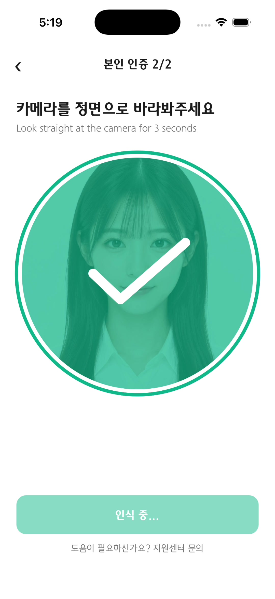<br/><sub><b>여권 인증</b></sub></td>
<td align="center">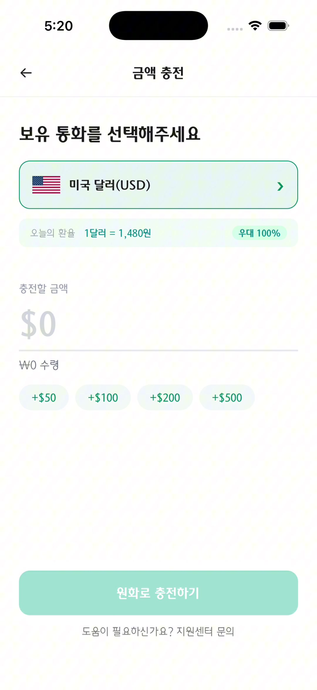<br/><sub><b>선불 충전</b></sub></td>
<td align="center">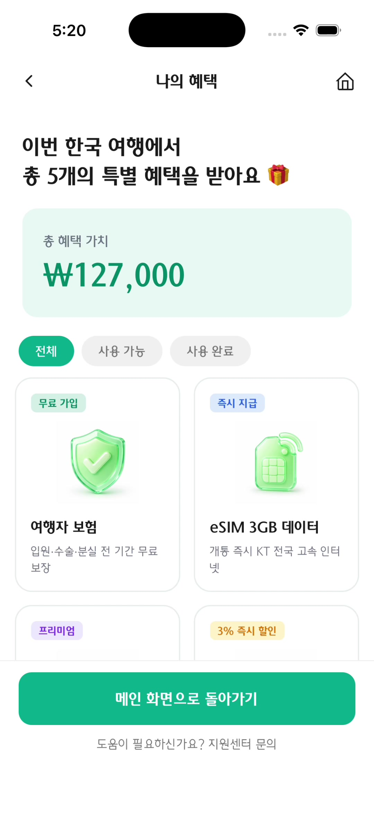<br/><sub><b>홈</b></sub></td>
<td align="center"><br/><sub><b>QR 결제</b></sub></td>
<td align="center">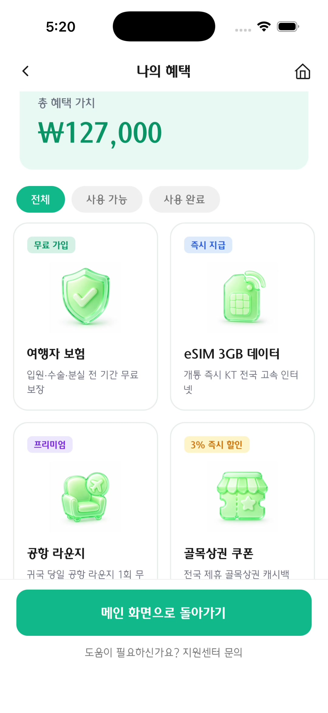<br/><sub><b>QR 더치페이</b></sub></td>
</tr>
</table>
</div>

<br/>

##  주요 기능

-  **신원확인 & 선불 충전** — 여권 기반 비대면 모바일 인증(신분증 사본 + 생체인증), 1회 최대 50만원 / 한도 200만원 충전
-  **기와체인 기반 QR 결제** — 사용자 선불충전금(원화 스테이블코인) ↔ 가맹점 앱 간 스마트컨트랙트 직거래 (MPM/CPM 양방향 지원)
-  **QR 더치페이** — 결제 직후 인원수만큼 자동 분배, 개인별 정산 QR 생성으로 수수료 없는 즉시 정산
-  **모바일 교통카드** — 실물 카드 없이 버스·지하철·따릉이 결제, 선불 잔액에서 후불 차감
-  **패키지 부가서비스** — 조건 충족 시 자동 제공되는 여행자 보험(하나손해보험), eSIM·공항 라운지 연동
-  **여권 인증 데모** — FastAPI 백엔드에서 MRZ(여권 기계판독영역) OCR + GPT 결합으로 여권 진위 확인

<br/>

##  기술 스택

| 영역 | 기술 |
| :-- | :-- |
| 앱 | React Native (Expo), React Navigation, Reanimated |
| 백엔드 | FastAPI, OpenCV, Tesseract OCR, PassportEye(MRZ 인식), OpenAI API |
| 결제 인프라 (기획) | 기와체인(Kia Chain, 두나무 하이퍼레저 패브릭 기반 허가형 블록체인), 원화 스테이블코인, 영지식 증명 기술(보자기) |

<br/>

##  폴더 구조

```
.
├── app/                    # React Native(Expo) 프론트엔드 앱
│   ├── src/screens/        # 화면별 컴포넌트 (충전, QR결제, 더치페이, 여권인증 등)
│   ├── src/components/     # 공통 UI 컴포넌트
│   ├── src/navigation/     # 앱 내비게이션
│   └── assets/             # 이미지, 폰트 등 리소스
├── backend/                # FastAPI 백엔드 (여권 MRZ OCR + GPT 검증)
├── docs/                   # 결선 발표자료(PPT), 데모 영상, 스크린샷
└── passport_demo.html      # 여권 스캔 데모 웹 페이지
```

<br/>

##  데모 자료

-  발표자료: [`docs/하나_청년_금융인재_결선자료.pdf`](docs/하나_청년_금융인재_결선자료.pdf)
-  데모 영상: [`docs/EZPZ_DEMO.mov`](docs/EZPZ_DEMO.mov)

###  발표자료 슬라이드

<div align="center"> <table> <tr> <td width="33%" align="center"><sub><b>1. 표지</b></sub><br/>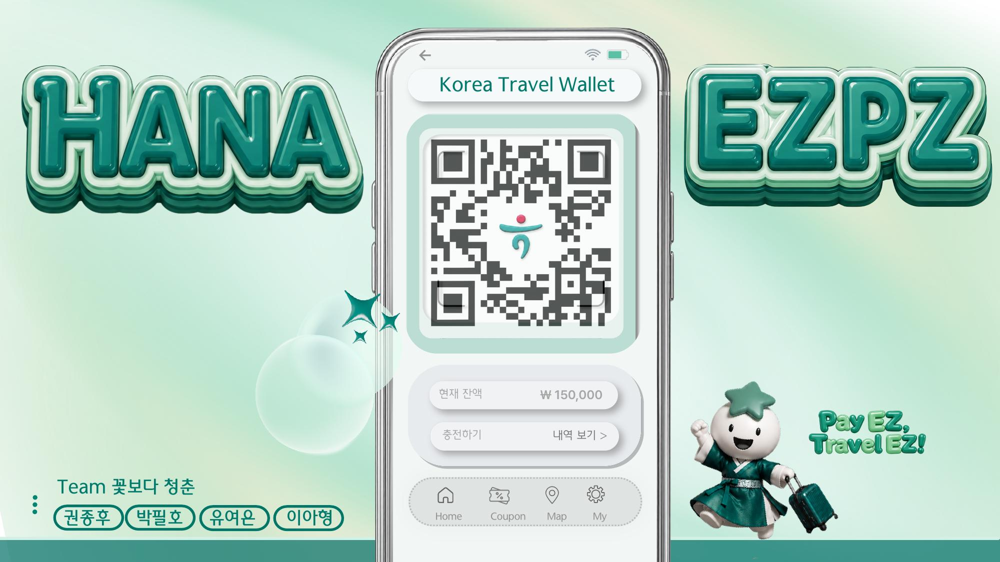</td> <td width="33%" align="center"><sub><b>2. 시장 배경 — 방한 외국인 관광객 성장세</b></sub><br/>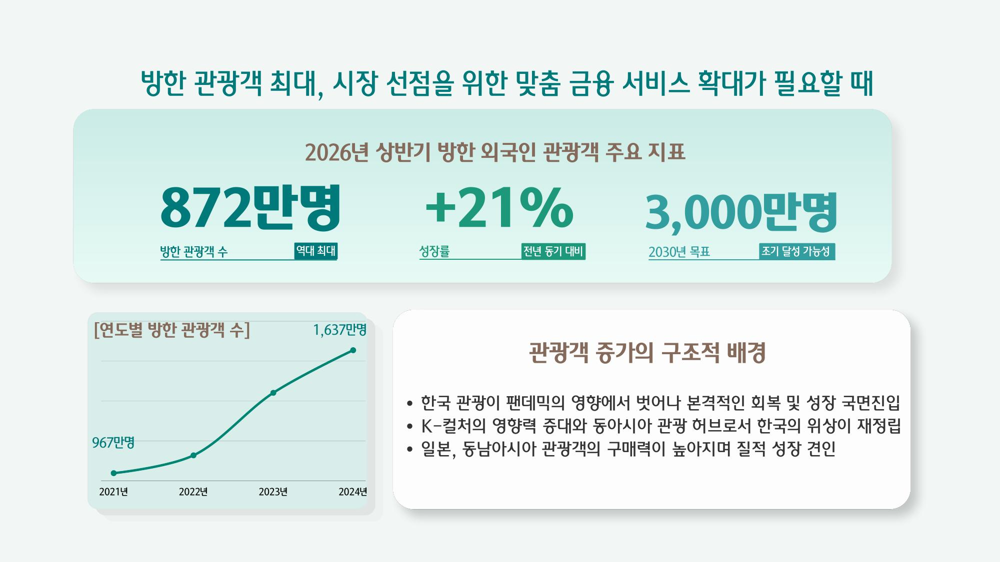</td> <td width="33%" align="center"><sub><b>3. 문제 정의 — 외국인 결제 수단 쏠림 현황</b></sub><br/>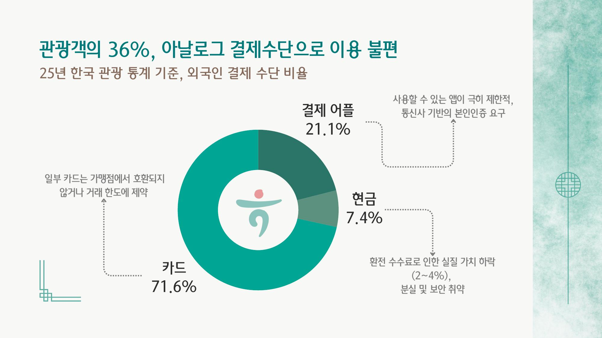</td> </tr> <tr> <td align="center"><sub><b>4. 서비스 소개 — 블록체인 기반 첫 결제 경험</b></sub><br/>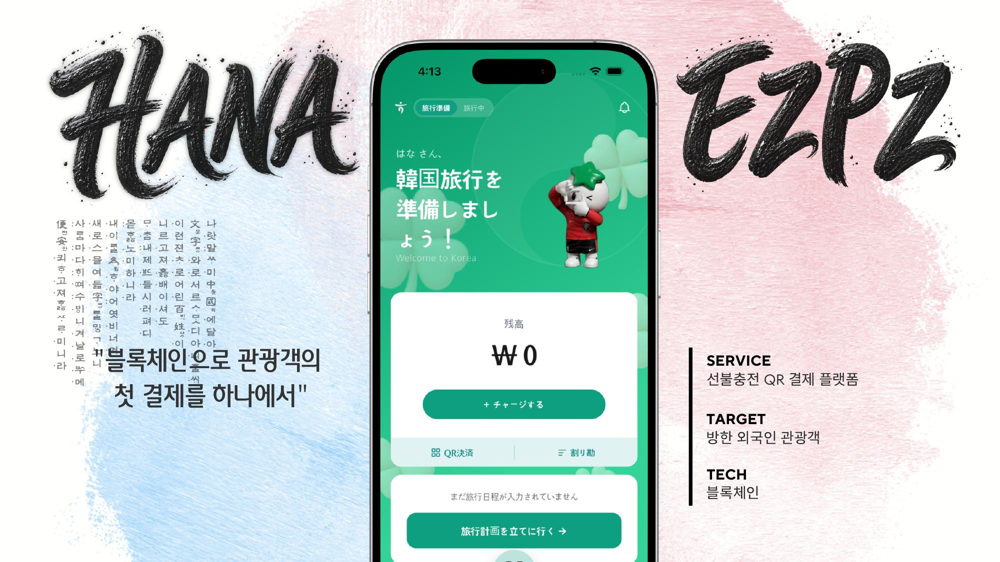</td> <td align="center"><sub><b>5. Overview — 메인/서브 서비스 구성</b></sub><br/>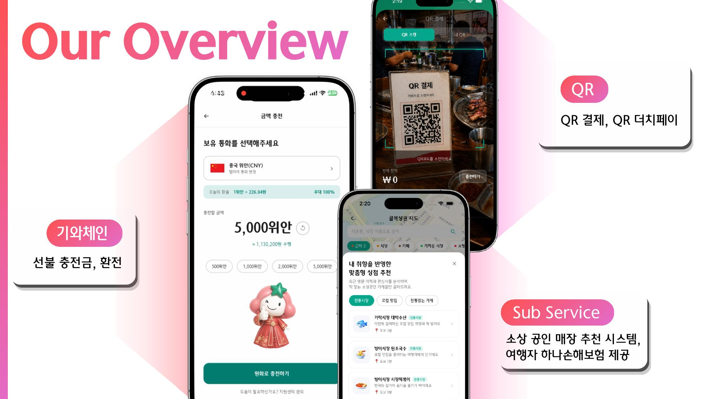</td> <td align="center"><sub><b>6. 협력 배경 — 하나금융그룹 × 두나무 컨소시엄</b></sub><br/>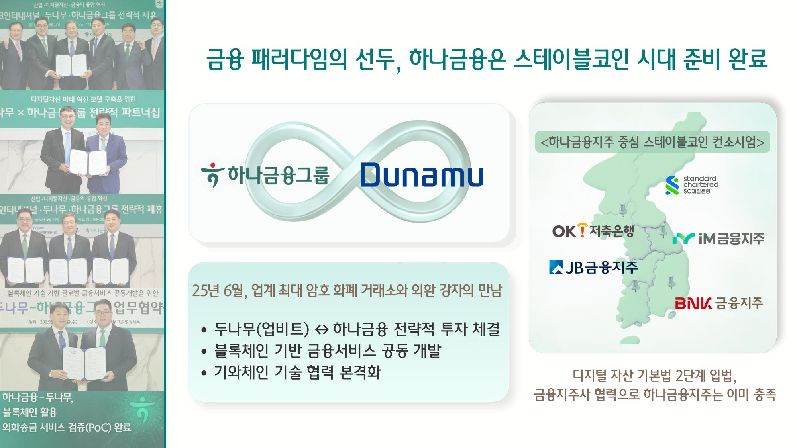</td> </tr> <tr> <td align="center"><sub><b>7. User Flow — 앱 사용 흐름</b></sub><br/>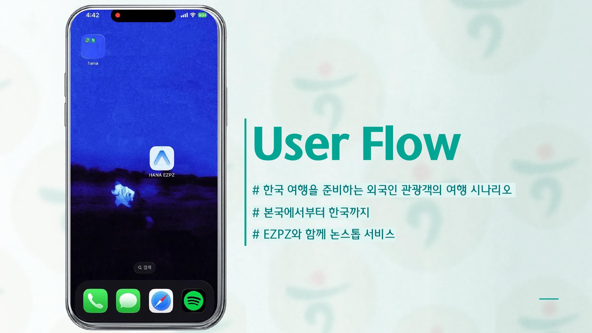</td> <td align="center"><sub><b>8. Technical Architecture — 기술 구조 개요</b></sub><br/>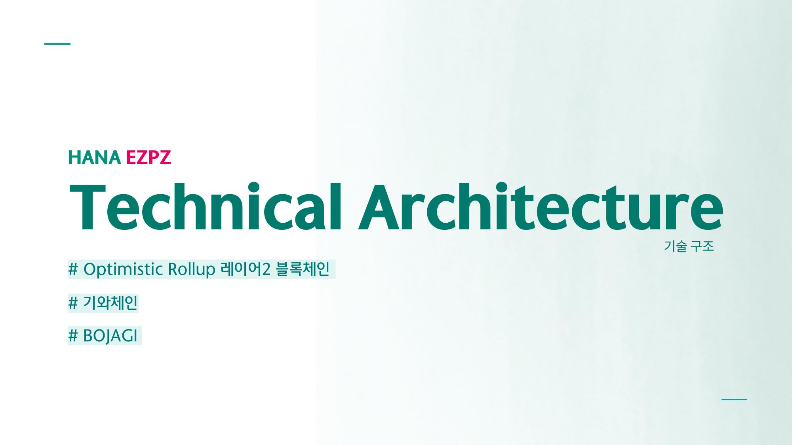</td> <td align="center"><sub><b>9. 기와체인 활용① — SWIFT 대체 국제 송금</b></sub><br/>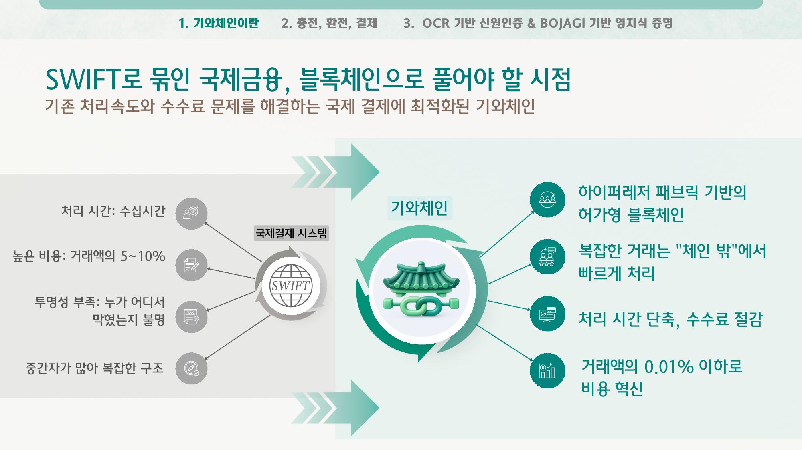</td> </tr> <tr> <td align="center"><sub><b>10. 기와체인 활용② — 결제 정산 구조 Before/After</b></sub><br/>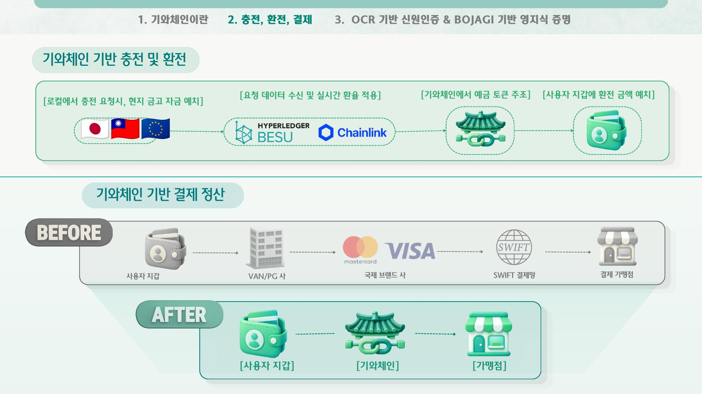</td> <td align="center"><sub><b>11. 기와체인 활용③ — eKYC·보자기 기반 인증</b></sub><br/>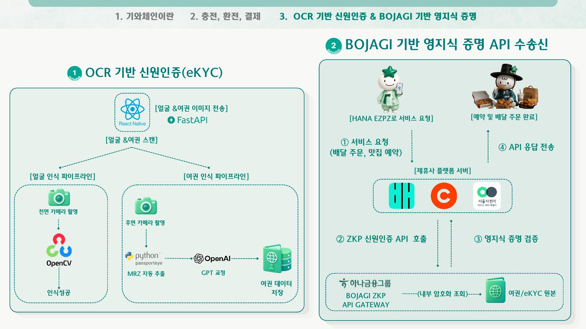</td> <td align="center"><sub><b>12. 경쟁 비교 — HANA EZPZ vs VISA vs WOWPASS</b></sub><br/>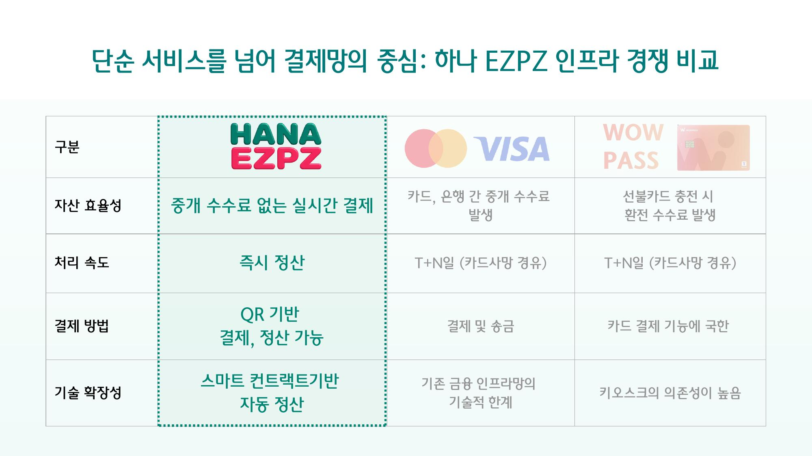</td> </tr> <tr> <td align="center"><sub><b>13. Business Model & ESG</b></sub><br/>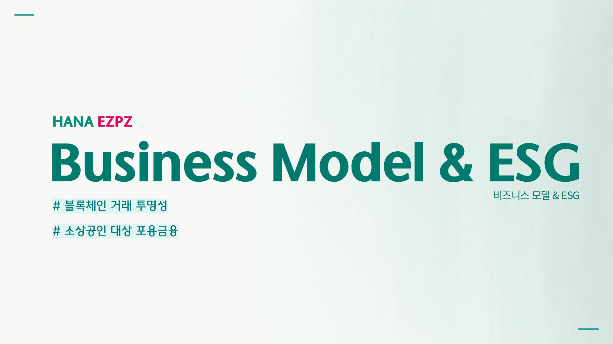</td> <td align="center"><sub><b>14. 수익 모델 — 수수료·예치금 운용·API 수수료</b></sub><br/>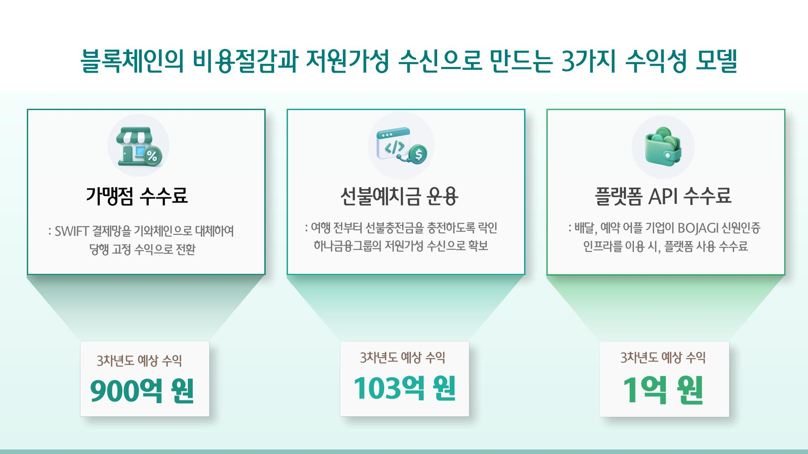</td> <td align="center"><sub><b>15. 사업성 분석 — 매출 추정 및 성장 전망</b></sub><br/>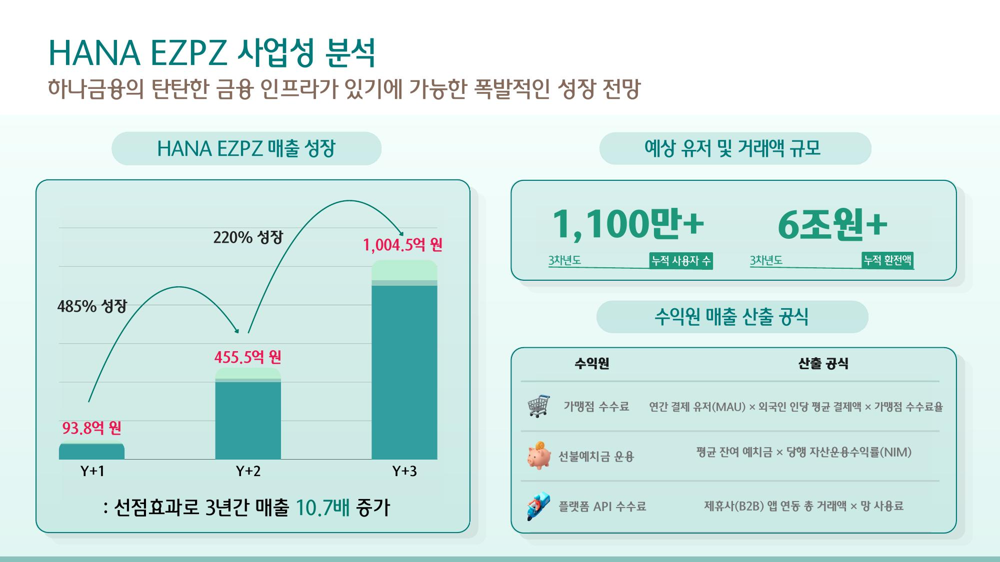</td> </tr> <tr> <td align="center"><sub><b>16. ESG — 소상공인 포용금융</b></sub><br/>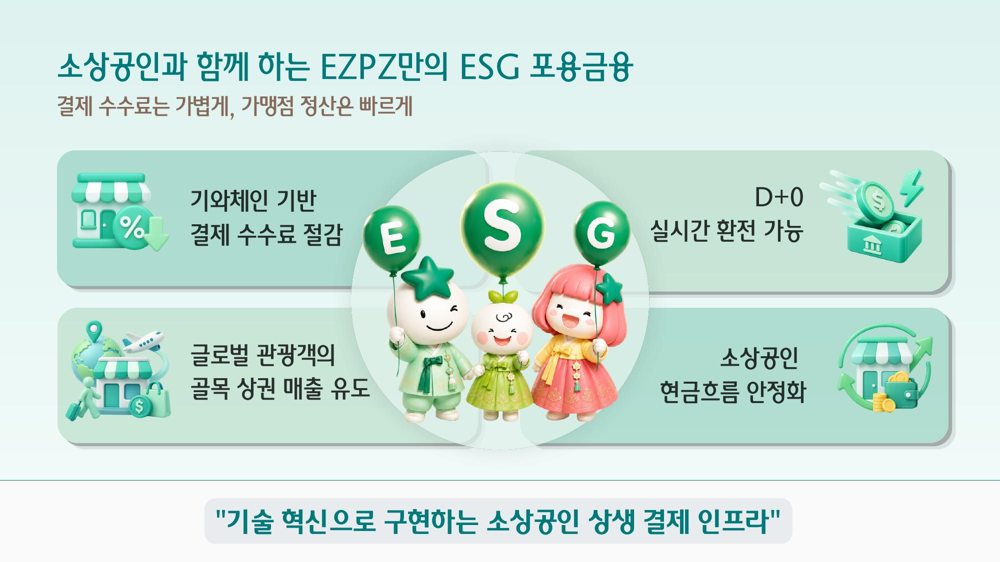</td> <td align="center"><sub><b>17. 마무리 — 함께 성장하는 금융</b></sub><br/></td> <td align="center"><sub><b>18. 부록 — 수익성 예측 변수 가정</b></sub><br/>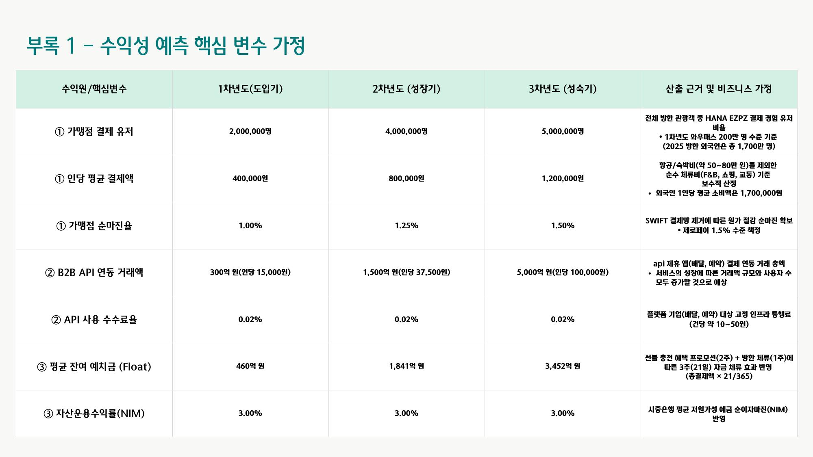</td> </tr> </table> </div> <br/>

## 실행 방법

**앱 (Expo)**

```bash
cd app
npm install
npm start          # Expo 개발 서버 실행
npm run web         # 웹으로 바로 실행
```

**백엔드 (FastAPI)**

```bash
cd backend
pip install -r requirements.txt
uvicorn main:app --reload
```

<br/>

